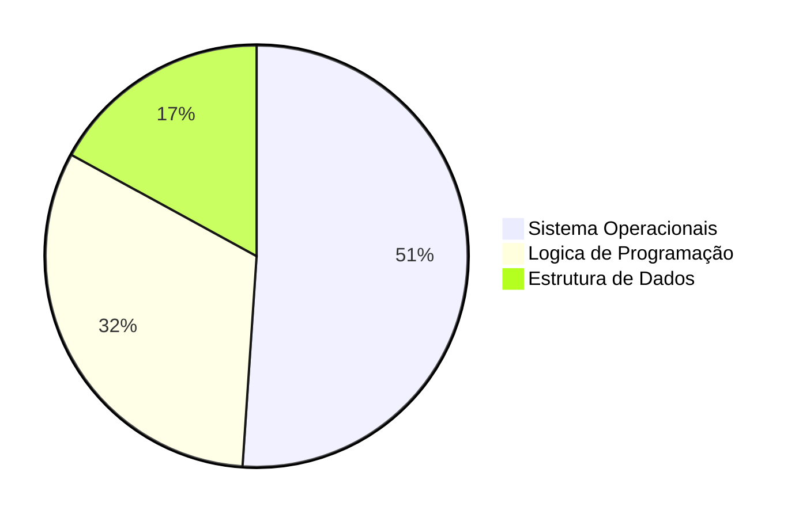

# Sobre o Projeto:
Desenvolvimento de um projeto que auxilie na gestao de atividades de cursos.


### COMANDOS

```
B[Gerenciador]

B --> C{Cursos}
C --> J[Engenharia de Software]
C --> K[Analise e Desenvolvimento de Sistemas]
C --> L[Técnico em Contabilidade]
```


### GRAFICO EM HORAS



### FONTE:


### 1.0 - FASES DO PROJETO

<ul>
  
  <li>
    <p><b><code>1.1 - [VIRTUAL ENV] </code></b></p>
    <p><i> Instrução:  </i></p>
  </li>
  
  <li>
    <p><b><code>1.2 - [FRONT-END] </code></b></p>
    <p><i> Fase-1: https://www.youtube.com/watch?v=wCOInE7-E0I  </i></p>
  </li> 
  
  <li>
    <p><b><code>1.3 - [BACK-END] </code></b></p>
    <p><i>  </i></p>
  </li>
  
</ul>


